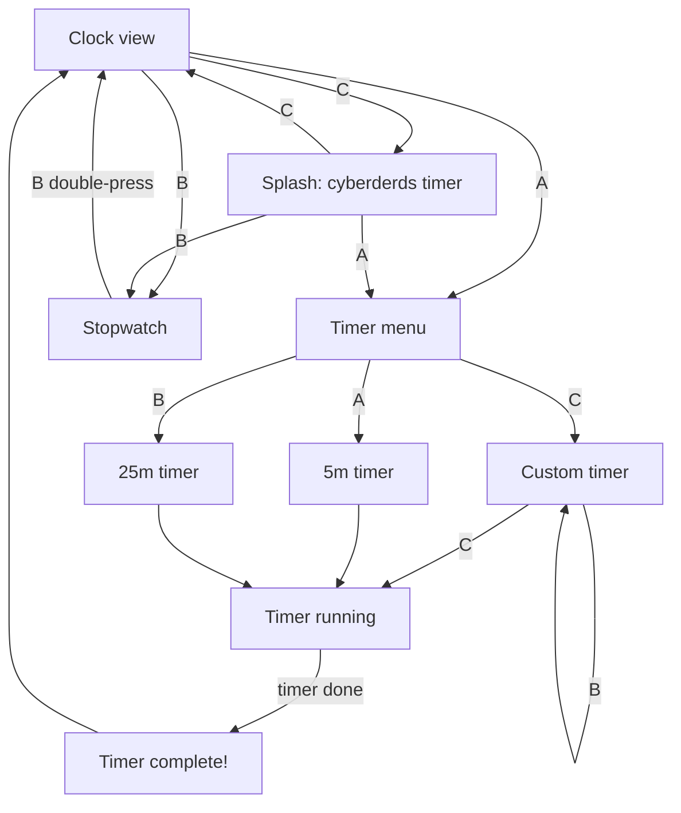

# Menu map

```mermaid
flowchart TD
    Clock["Clock view"]
    Splash["Splash: cyberderds timer"]
    TimerMenu["Timer menu"]
    Stopwatch["Stopwatch"]
    Custom["Custom timer"]
    Timer5["5m timer"]
    Timer25["25m timer"]
    TimerRunning["Timer running"]
    Complete["Timer complete!"]

    Clock --> |A| TimerMenu
    Clock --> |B| Stopwatch
    Clock --> |C| Splash
    Splash --> |A| TimerMenu
    Splash --> |B| Stopwatch
    Splash --> |C| Clock
    TimerMenu --> |A| Timer5
    TimerMenu --> |B| Timer25
    TimerMenu --> |C| Custom
    Custom --> |A| Custom
    Custom --> |B| Custom
    Custom --> |C| TimerRunning
    Timer5 --> TimerRunning
    Timer25 --> TimerRunning
    TimerRunning --> |timer done| Complete
    Complete --> Clock
    Stopwatch --> |B double-press| Clock
```
